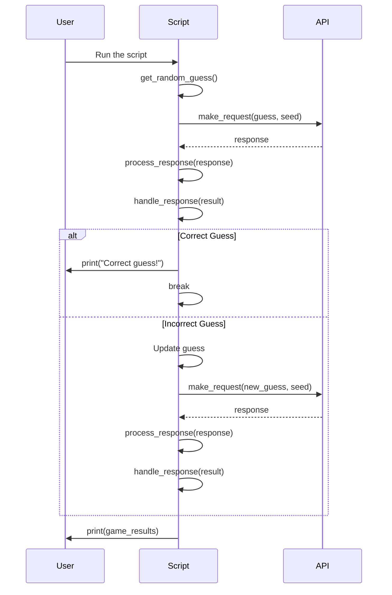

# Python: Wordle Puzzle Game Solution

## **Overview**

This project aims to build a solution that automatically guesses the random word of a Wordle puzzle against the backend of Votee. The solution involves making API requests with specific parameters and analyzing the results to find the hidden word.

Objective:

- [x] Automate the Wordle guessing process.

- [x] Utilize a backend API to submit guesses and receive feedback.

- [x] Make multiple attempts to uncover the hidden word.

Components:

(a) Build a solution to guess the random word of Wordle puzzle against the backend of Votee
API Integration: Connect to the Wordle-like puzzle API provided by Votee.

Guessing Algorithm: Implement a strategy to guess the hidden word.

Data Handling: Process and analyze the feedback from the API.

(b) Make requests with seed, size, and guessed words

API Endpoint: [https://wordle.votee.dev:8000/random](https://wordle.votee.dev:8000/random)

Parameters:

seed: A fixed value to ensure consistent puzzles.

size: The number of letters in the word (typically 5).

guess: The word being guessed.

(c) Feedback and Results

API Response: The API returns a list of buckets, each containing:

| Field  | Description                     | Data Type                            |
| ------ | ------------------------------- | ------------------------------------ |
| slot   | Position of the character.      | Int                                  |
| guess  | The guessed character.          | String                               |
| result | Result of the guessed character | Enum[`absent`, `present`, `correct`] |

Note:

absent: The letter is not in the word.

present: The letter is in the word but in a different position.

correct: The letter is in the correct position.

(d) Example Guessing Flow

Initialize: Set the seed and size parameters.

First Guess: Make an initial random guess.

Process Feedback: Analyze the response to refine the next guess.

Iterate: Continue making guesses and refining based on feedback.

Conclude: Stop when the hidden word is correctly guessed.

## **Usage**

Install prequistes

```bash
make venv
```

Activate the vitural environment

```bash
source venv/Scripts/activate
```

Install requirmen

To run the default setting of guess wordle, using following command

```bash
make run
```

## **Process**

Step 1: Build environment to create solution for the wordle puzzle game

(a) Add `__init__.py` and `guess_wordle.py`

(b) Add `requirements.txt`

(c) Add `.gitignore` for Python [https://github.com/github/gitignore/blob/main/Python.gitignore](https://github.com/github/gitignore/blob/main/Python.gitignore)

(d) Add `Makefile`

Step 2: Build first grant look of the program

First, prompt to have the first stage of program

```txt
Write me an Python 3 program that
(a) Target: automatically guesses random words against the API, using the following command as an example: curl -v ‘https://wordle.votee.dev:8000/random?guess=theft&seed=1234'
(b) Using the tutorial in: https://thamara.dev/posts/guessing-better-in-wordle/
(c) Constrant: Using httpx for request to the API, Using polars for dataframe, tabular
```

Then install the related concepts for project: codebase, scripts, Makefile

Step 3: Build an sequence of how the way we handle that

```txt
Can you describe me the way to handle that with Mermaid diagram
```



This sequence diagram illustrates the flow:

User runs the script.

Script generates a random guess and makes a request to the API.

API returns the response.

Script processes the response and handles the result.

- If the guess is correct, the script breaks out of the loop and prints "Correct guess!"

- If the guess is incorrect, the script updates the guess and repeats the process.

Step 4: Based on the idea, interate with try and fix the problem

Example:

```txt
Fix this `AttributeError: 'list' object has no attribute 'get'`
and using API from You can find the API documentation at the following link: https://wordle.votee.dev:8000/redoc
```

Step 5: Handle the idea, flow of the scripts, rewrite the logic with supported packages

Step 6: Rewrite documentation with Copilot

```txt
Write me the overview of the wordle guess
(a) Introduction what is it
(b) Example on the guessing flow
(c) The constant of the wordle (size, seed, ...)
```

## **Note**

AI Code program: Using Copilot, Codedium

Documentation: Copilot

Tutorial:

- <https://thamara.dev/posts/guessing-better-in-wordle/>
