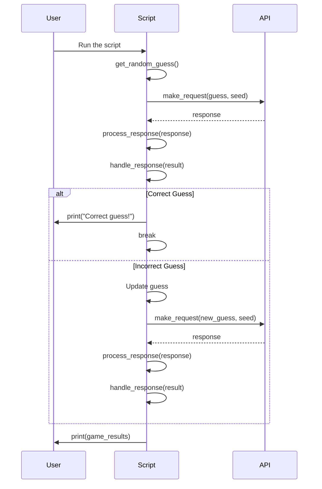

# Python: Wordle Puzzle Game Solution

## **Overview**

This project aims to build a solution that automatically guesses the random word of a Wordle puzzle against the backend of Votee.
The solution involves making API requests with specific parameters and analyzing the results to find the hidden word.

Objective:

- [x] Automate the Wordle guessing process.

- [x] Utilize a backend API to submit guesses and receive feedback.

- [x] Make multiple attempts to uncover the hidden word.

Components:

(a) Build a solution to guess the random word of Wordle puzzle against the backend of Votee
API Integration: Connect to the Wordle-like puzzle API provided by Votee.

Guessing Algorithm: Implement a strategy to guess the hidden word.

Data Handling: Process and analyze the feedback from the API.

(b) Make requests with seed, size, and guessed words

API Endpoint: [https://wordle.votee.dev:8000/random](https://wordle.votee.dev:8000/random)

Parameters:

seed: A fixed value to ensure consistent puzzles.

size: The number of letters in the word (typically 5).

guess: The word being guessed.

(c) Feedback and Results

API Response: The API returns a list of buckets, each containing:

| Field  | Description                     | Data Type                            |
| ------ | ------------------------------- | ------------------------------------ |
| slot   | Position of the character.      | Int                                  |
| guess  | The guessed character.          | String                               |
| result | Result of the guessed character | Enum[`absent`, `present`, `correct`] |

Note:

absent: The letter is not in the word.

present: The letter is in the word but in a different position.

correct: The letter is in the correct position.

(d) Example Guessing Flow

Initialize: Set the seed and size parameters.

First Guess: Make an initial random guess.

Process Feedback: Analyze the response to refine the next guess.

Iterate: Continue making guesses and refining based on feedback.

Conclude: Stop when the hidden word is correctly guessed.

## **Result**

After run scripts with a few tries, the result was `theft`

## **Usage**

[1] Install prerequisites

```bash
make venv
```

[2] Activate the vitural environment

```bash
source venv/Scripts/activate
```

[3] Install dependencies

```bash
make install
```

[4] Run script:

To run the default setting of guess wordle, using following command

```bash
make run
# python guess_wordle.py --size 5 --seed 1234
# INFO:__main__:2024-10-20T14:03:49.431347Z [info     ] Starting guess random wordle   [__main__] project=Votee service=wordle-random-guess
# INFO:__main__:2024-10-20T14:03:49.432346Z [info     ] Guess: aaaaa                   [__main__] project=Votee service=wordle-random-guess
# INFO:httpx:HTTP Request: GET https://wordle.votee.dev:8000/random?guess=aaaaa&size=5&seed=1234 "HTTP/1.1 200 OK"
# INFO:__main__:2024-10-20T14:03:49.770937Z [info     ] Letter a not present in the word at position 0. Break go to another part [__main__] project=Votee service=wordle-random-guess
# INFO:__main__:2024-10-20T14:03:49.771444Z [info     ] Letter a not present in the word at position 1. Break go to another part [__main__] project=Votee service=wordle-random-guess
# INFO:__main__:2024-10-20T14:03:49.771444Z [info     ] Letter a not present in the word at position 2. Break go to another part [__main__] project=Votee service=wordle-random-guess
# INFO:__main__:2024-10-20T14:03:49.771982Z [info     ] Letter a not present in the word at position 3. Break go to another part [__main__] project=Votee service=wordle-random-guess
# INFO:__main__:2024-10-20T14:03:49.771982Z [info     ] Letter a not present in the word at position 4. Break go to another part [__main__] project=Votee service=wordle-random-guess
# INFO:__main__:2024-10-20T14:03:49.773011Z [info     ] Guess: bbbbb                   [__main__] project=Votee service=wordle-random-guess
# INFO:httpx:HTTP Request: GET https://wordle.votee.dev:8000/random?guess=bbbbb&size=5&seed=1234 "HTTP/1.1 200 OK"
# INFO:__main__:2024-10-20T14:03:49.988298Z [info     ] Letter b not present in the word at position 0. Break go to another part [__main__] project=Votee service=wordle-random-guess
# INFO:__main__:2024-10-20T14:03:49.988298Z [info     ] Letter b not present in the word at position 1. Break go to another part [__main__] project=Votee service=wordle-random-guess
# INFO:__main__:2024-10-20T14:03:49.989708Z [info     ] Letter b not present in the word at position 2. Break go to another part [__main__] project=Votee service=wordle-random-guess
# INFO:__main__:2024-10-20T14:03:49.989708Z [info     ] Letter b not present in the word at position 3. Break go to another part [__main__] project=Votee service=wordle-random-guess
# INFO:__main__:2024-10-20T14:03:49.990750Z [info     ] Letter b not present in the word at position 4. Break go to another part [__main__] project=Votee service=wordle-random-guess
# INFO:__main__:2024-10-20T14:03:49.990750Z [info     ] Guess: ccccc                   [__main__] project=Votee service=wordle-random-guess
# INFO:httpx:HTTP Request: GET https://wordle.votee.dev:8000/random?guess=ccccc&size=5&seed=1234 "HTTP/1.1 200 OK"
# INFO:__main__:2024-10-20T14:03:50.157853Z [info     ] Letter c not present in the word at position 0. Break go to another part [__main__] project=Votee service=wordle-random-guess
# INFO:__main__:2024-10-20T14:03:50.157853Z [info     ] Letter c not present in the word at position 1. Break go to another part [__main__] project=Votee service=wordle-random-guess
# INFO:__main__:2024-10-20T14:03:50.158853Z [info     ] Letter c not present in the word at position 2. Break go to another part [__main__] project=Votee service=wordle-random-guess
# INFO:__main__:2024-10-20T14:03:50.158853Z [info     ] Letter c not present in the word at position 3. Break go to another part [__main__] project=Votee service=wordle-random-guess
# INFO:__main__:2024-10-20T14:03:50.159858Z [info     ] Letter c not present in the word at position 4. Break go to another part [__main__] project=Votee service=wordle-random-guess
# INFO:__main__:2024-10-20T14:03:50.159858Z [info     ] Guess: ddddd                   [__main__] project=Votee service=wordle-random-guess
# INFO:httpx:HTTP Request: GET https://wordle.votee.dev:8000/random?guess=ddddd&size=5&seed=1234 "HTTP/1.1 200 OK"
# INFO:__main__:2024-10-20T14:03:50.380067Z [info     ] Letter d not present in the word at position 0. Break go to another part [__main__] project=Votee service=wordle-random-guess
# INFO:__main__:2024-10-20T14:03:50.381081Z [info     ] Letter d not present in the word at position 1. Break go to another part [__main__] project=Votee service=wordle-random-guess
# INFO:__main__:2024-10-20T14:03:50.382143Z [info     ] Letter d not present in the word at position 2. Break go to another part [__main__] project=Votee service=wordle-random-guess
# INFO:__main__:2024-10-20T14:03:50.382662Z [info     ] Letter d not present in the word at position 3. Break go to another part [__main__] project=Votee service=wordle-random-guess
# INFO:__main__:2024-10-20T14:03:50.383676Z [info     ] Letter d not present in the word at position 4. Break go to another part [__main__] project=Votee service=wordle-random-guess
# INFO:__main__:2024-10-20T14:03:50.383676Z [info     ] Guess: eeeee                   [__main__] project=Votee service=wordle-random-guess
# INFO:httpx:HTTP Request: GET https://wordle.votee.dev:8000/random?guess=eeeee&size=5&seed=1234 "HTTP/1.1 200 OK"
# INFO:__main__:2024-10-20T14:03:50.581929Z [info     ] Letter e present in the word at position 0, but in a different position. [__main__] project=Votee service=wordle-random-guess
# INFO:__main__:2024-10-20T14:03:50.584110Z [info     ] Letter e present in the word at position 1, but in a different position. [__main__] project=Votee service=wordle-random-guess
# INFO:__main__:2024-10-20T14:03:50.584731Z [info     ] Correct guess! Letter e is at position 2 [__main__] project=Votee service=wordle-random-guess
# INFO:__main__:2024-10-20T14:03:50.585241Z [info     ] Letter e present in the word at position 3, but in a different position. [__main__] project=Votee service=wordle-random-guess
# INFO:__main__:2024-10-20T14:03:50.585241Z [info     ] Letter e present in the word at position 4, but in a different position. [__main__] project=Votee service=wordle-random-guess
# INFO:__main__:2024-10-20T14:03:50.586254Z [info     ] Guess: ffeff                   [__main__] project=Votee service=wordle-random-guess
# INFO:httpx:HTTP Request: GET https://wordle.votee.dev:8000/random?guess=ffeff&size=5&seed=1234 "HTTP/1.1 200 OK"
# INFO:__main__:2024-10-20T14:03:50.802416Z [info     ] Letter f present in the word at position 0, but in a different position. [__main__] project=Votee service=wordle-random-guess
# INFO:__main__:2024-10-20T14:03:50.803414Z [info     ] Letter f present in the word at position 1, but in a different position. [__main__] project=Votee service=wordle-random-guess
# INFO:__main__:2024-10-20T14:03:50.803414Z [info     ] Correct guess! Letter e is at position 2 [__main__] project=Votee service=wordle-random-guess
# INFO:__main__:2024-10-20T14:03:50.804427Z [info     ] Correct guess! Letter f is at position 3 [__main__] project=Votee service=wordle-random-guess
# INFO:__main__:2024-10-20T14:03:50.805411Z [info     ] Letter f present in the word at position 4, but in a different position. [__main__] project=Votee service=wordle-random-guess
# INFO:__main__:2024-10-20T14:03:50.805411Z [info     ] Guess: ggefg                   [__main__] project=Votee service=wordle-random-guess
# INFO:httpx:HTTP Request: GET https://wordle.votee.dev:8000/random?guess=ggefg&size=5&seed=1234 "HTTP/1.1 200 OK"
# INFO:__main__:2024-10-20T14:03:50.987164Z [info     ] Letter g not present in the word at position 0. Break go to another part [__main__] project=Votee service=wordle-random-guess
# INFO:__main__:2024-10-20T14:03:50.987164Z [info     ] Letter g not present in the word at position 1. Break go to another part [__main__] project=Votee service=wordle-random-guess
# INFO:__main__:2024-10-20T14:03:50.988164Z [info     ] Correct guess! Letter e is at position 2 [__main__] project=Votee service=wordle-random-guess
# INFO:__main__:2024-10-20T14:03:50.988164Z [info     ] Correct guess! Letter f is at position 3 [__main__] project=Votee service=wordle-random-guess
# INFO:__main__:2024-10-20T14:03:50.989164Z [info     ] Letter g not present in the word at position 4. Break go to another part [__main__] project=Votee service=wordle-random-guess
# INFO:__main__:2024-10-20T14:03:50.989164Z [info     ] Guess: hhefh                   [__main__] project=Votee service=wordle-random-guess
# INFO:httpx:HTTP Request: GET https://wordle.votee.dev:8000/random?guess=hhefh&size=5&seed=1234 "HTTP/1.1 200 OK"
# INFO:__main__:2024-10-20T14:03:51.205676Z [info     ] Letter h present in the word at position 0, but in a different position. [__main__] project=Votee service=wordle-random-guess
# INFO:__main__:2024-10-20T14:03:51.206675Z [info     ] Correct guess! Letter h is at position 1 [__main__] project=Votee service=wordle-random-guess
# INFO:__main__:2024-10-20T14:03:51.206675Z [info     ] Correct guess! Letter e is at position 2 [__main__] project=Votee service=wordle-random-guess
# INFO:__main__:2024-10-20T14:03:51.207680Z [info     ] Correct guess! Letter f is at position 3 [__main__] project=Votee service=wordle-random-guess
# INFO:__main__:2024-10-20T14:03:51.208672Z [info     ] Letter h present in the word at position 4, but in a different position. [__main__] project=Votee service=wordle-random-guess
# INFO:__main__:2024-10-20T14:03:51.209670Z [info     ] Guess: ihefi                   [__main__] project=Votee service=wordle-random-guess
# INFO:httpx:HTTP Request: GET https://wordle.votee.dev:8000/random?guess=ihefi&size=5&seed=1234 "HTTP/1.1 200 OK"
# INFO:__main__:2024-10-20T14:03:51.427117Z [info     ] Letter i not present in the word at position 0. Break go to another part [__main__] project=Votee service=wordle-random-guess
# INFO:__main__:2024-10-20T14:03:51.429102Z [info     ] Correct guess! Letter h is at position 1 [__main__] project=Votee service=wordle-random-guess
# INFO:__main__:2024-10-20T14:03:51.430135Z [info     ] Correct guess! Letter e is at position 2 [__main__] project=Votee service=wordle-random-guess
# INFO:__main__:2024-10-20T14:03:51.431098Z [info     ] Correct guess! Letter f is at position 3 [__main__] project=Votee service=wordle-random-guess
# INFO:__main__:2024-10-20T14:03:51.432097Z [info     ] Letter i not present in the word at position 4. Break go to another part [__main__] project=Votee service=wordle-random-guess
# INFO:__main__:2024-10-20T14:03:51.433382Z [info     ] Guess: jhefj                   [__main__] project=Votee service=wordle-random-guess
# INFO:httpx:HTTP Request: GET https://wordle.votee.dev:8000/random?guess=jhefj&size=5&seed=1234 "HTTP/1.1 200 OK"
# INFO:__main__:2024-10-20T14:03:51.605792Z [info     ] Letter j not present in the word at position 0. Break go to another part [__main__] project=Votee service=wordle-random-guess
# INFO:__main__:2024-10-20T14:03:51.606683Z [info     ] Correct guess! Letter h is at position 1 [__main__] project=Votee service=wordle-random-guess
# INFO:__main__:2024-10-20T14:03:51.608692Z [info     ] Correct guess! Letter e is at position 2 [__main__] project=Votee service=wordle-random-guess
# INFO:__main__:2024-10-20T14:03:51.609703Z [info     ] Correct guess! Letter f is at position 3 [__main__] project=Votee service=wordle-random-guess
# INFO:__main__:2024-10-20T14:03:51.611270Z [info     ] Letter j not present in the word at position 4. Break go to another part [__main__] project=Votee service=wordle-random-guess
# INFO:__main__:2024-10-20T14:03:51.613295Z [info     ] Guess: khefk                   [__main__] project=Votee service=wordle-random-guess
# INFO:httpx:HTTP Request: GET https://wordle.votee.dev:8000/random?guess=khefk&size=5&seed=1234 "HTTP/1.1 200 OK"
# INFO:__main__:2024-10-20T14:03:51.813181Z [info     ] Letter k not present in the word at position 0. Break go to another part [__main__] project=Votee service=wordle-random-guess
# INFO:__main__:2024-10-20T14:03:51.815180Z [info     ] Correct guess! Letter h is at position 1 [__main__] project=Votee service=wordle-random-guess
# INFO:__main__:2024-10-20T14:03:51.816171Z [info     ] Correct guess! Letter e is at position 2 [__main__] project=Votee service=wordle-random-guess
# INFO:__main__:2024-10-20T14:03:51.816171Z [info     ] Correct guess! Letter f is at position 3 [__main__] project=Votee service=wordle-random-guess
# INFO:__main__:2024-10-20T14:03:51.817182Z [info     ] Letter k not present in the word at position 4. Break go to another part [__main__] project=Votee service=wordle-random-guess
# INFO:__main__:2024-10-20T14:03:51.818181Z [info     ] Guess: lhefl                   [__main__] project=Votee service=wordle-random-guess
# INFO:httpx:HTTP Request: GET https://wordle.votee.dev:8000/random?guess=lhefl&size=5&seed=1234 "HTTP/1.1 200 OK"
# INFO:__main__:2024-10-20T14:03:52.037179Z [info     ] Letter l not present in the word at position 0. Break go to another part [__main__] project=Votee service=wordle-random-guess
# INFO:__main__:2024-10-20T14:03:52.039219Z [info     ] Correct guess! Letter h is at position 1 [__main__] project=Votee service=wordle-random-guess
# INFO:__main__:2024-10-20T14:03:52.041155Z [info     ] Correct guess! Letter e is at position 2 [__main__] project=Votee service=wordle-random-guess
# INFO:__main__:2024-10-20T14:03:52.042186Z [info     ] Correct guess! Letter f is at position 3 [__main__] project=Votee service=wordle-random-guess
# INFO:__main__:2024-10-20T14:03:52.044126Z [info     ] Letter l not present in the word at position 4. Break go to another part [__main__] project=Votee service=wordle-random-guess
# INFO:__main__:2024-10-20T14:03:52.045225Z [info     ] Guess: mhefm                   [__main__] project=Votee service=wordle-random-guess
# INFO:httpx:HTTP Request: GET https://wordle.votee.dev:8000/random?guess=mhefm&size=5&seed=1234 "HTTP/1.1 200 OK"
# INFO:__main__:2024-10-20T14:03:52.226195Z [info     ] Letter m not present in the word at position 0. Break go to another part [__main__] project=Votee service=wordle-random-guess
# INFO:__main__:2024-10-20T14:03:52.227193Z [info     ] Correct guess! Letter h is at position 1 [__main__] project=Votee service=wordle-random-guess
# INFO:__main__:2024-10-20T14:03:52.227193Z [info     ] Correct guess! Letter e is at position 2 [__main__] project=Votee service=wordle-random-guess
# INFO:__main__:2024-10-20T14:03:52.228207Z [info     ] Correct guess! Letter f is at position 3 [__main__] project=Votee service=wordle-random-guess
# INFO:__main__:2024-10-20T14:03:52.228207Z [info     ] Letter m not present in the word at position 4. Break go to another part [__main__] project=Votee service=wordle-random-guess
# INFO:__main__:2024-10-20T14:03:52.228207Z [info     ] Guess: nhefn                   [__main__] project=Votee service=wordle-random-guess
# INFO:httpx:HTTP Request: GET https://wordle.votee.dev:8000/random?guess=nhefn&size=5&seed=1234 "HTTP/1.1 200 OK"
# INFO:__main__:2024-10-20T14:03:52.433420Z [info     ] Letter n not present in the word at position 0. Break go to another part [__main__] project=Votee service=wordle-random-guess
# INFO:__main__:2024-10-20T14:03:52.433946Z [info     ] Correct guess! Letter h is at position 1 [__main__] project=Votee service=wordle-random-guess
# INFO:__main__:2024-10-20T14:03:52.433946Z [info     ] Correct guess! Letter e is at position 2 [__main__] project=Votee service=wordle-random-guess
# INFO:__main__:2024-10-20T14:03:52.433946Z [info     ] Correct guess! Letter f is at position 3 [__main__] project=Votee service=wordle-random-guess
# INFO:__main__:2024-10-20T14:03:52.434953Z [info     ] Letter n not present in the word at position 4. Break go to another part [__main__] project=Votee service=wordle-random-guess
# INFO:__main__:2024-10-20T14:03:52.434953Z [info     ] Guess: ohefo                   [__main__] project=Votee service=wordle-random-guess
# INFO:httpx:HTTP Request: GET https://wordle.votee.dev:8000/random?guess=ohefo&size=5&seed=1234 "HTTP/1.1 200 OK"
# INFO:__main__:2024-10-20T14:03:52.630796Z [info     ] Letter o not present in the word at position 0. Break go to another part [__main__] project=Votee service=wordle-random-guess
# INFO:__main__:2024-10-20T14:03:52.631796Z [info     ] Correct guess! Letter h is at position 1 [__main__] project=Votee service=wordle-random-guess
# INFO:__main__:2024-10-20T14:03:52.631796Z [info     ] Correct guess! Letter e is at position 2 [__main__] project=Votee service=wordle-random-guess
# INFO:__main__:2024-10-20T14:03:52.631796Z [info     ] Correct guess! Letter f is at position 3 [__main__] project=Votee service=wordle-random-guess
# INFO:__main__:2024-10-20T14:03:52.632797Z [info     ] Letter o not present in the word at position 4. Break go to another part [__main__] project=Votee service=wordle-random-guess
# INFO:__main__:2024-10-20T14:03:52.632797Z [info     ] Guess: phefp                   [__main__] project=Votee service=wordle-random-guess
# INFO:httpx:HTTP Request: GET https://wordle.votee.dev:8000/random?guess=phefp&size=5&seed=1234 "HTTP/1.1 200 OK"
# INFO:__main__:2024-10-20T14:03:52.873427Z [info     ] Letter p not present in the word at position 0. Break go to another part [__main__] project=Votee service=wordle-random-guess
# INFO:__main__:2024-10-20T14:03:52.874426Z [info     ] Correct guess! Letter h is at position 1 [__main__] project=Votee service=wordle-random-guess
# INFO:__main__:2024-10-20T14:03:52.874426Z [info     ] Correct guess! Letter e is at position 2 [__main__] project=Votee service=wordle-random-guess
# INFO:__main__:2024-10-20T14:03:52.874426Z [info     ] Correct guess! Letter f is at position 3 [__main__] project=Votee service=wordle-random-guess
# INFO:__main__:2024-10-20T14:03:52.875427Z [info     ] Letter p not present in the word at position 4. Break go to another part [__main__] project=Votee service=wordle-random-guess
# INFO:__main__:2024-10-20T14:03:52.875427Z [info     ] Guess: qhefq                   [__main__] project=Votee service=wordle-random-guess
# INFO:httpx:HTTP Request: GET https://wordle.votee.dev:8000/random?guess=qhefq&size=5&seed=1234 "HTTP/1.1 200 OK"
# INFO:__main__:2024-10-20T14:03:53.073246Z [info     ] Letter q not present in the word at position 0. Break go to another part [__main__] project=Votee service=wordle-random-guess
# INFO:__main__:2024-10-20T14:03:53.073246Z [info     ] Correct guess! Letter h is at position 1 [__main__] project=Votee service=wordle-random-guess
# INFO:__main__:2024-10-20T14:03:53.073246Z [info     ] Correct guess! Letter e is at position 2 [__main__] project=Votee service=wordle-random-guess
# INFO:__main__:2024-10-20T14:03:53.074244Z [info     ] Correct guess! Letter f is at position 3 [__main__] project=Votee service=wordle-random-guess
# INFO:__main__:2024-10-20T14:03:53.074244Z [info     ] Letter q not present in the word at position 4. Break go to another part [__main__] project=Votee service=wordle-random-guess
# INFO:__main__:2024-10-20T14:03:53.074244Z [info     ] Guess: rhefr                   [__main__] project=Votee service=wordle-random-guess
# INFO:httpx:HTTP Request: GET https://wordle.votee.dev:8000/random?guess=rhefr&size=5&seed=1234 "HTTP/1.1 200 OK"
# INFO:__main__:2024-10-20T14:03:53.277788Z [info     ] Letter r not present in the word at position 0. Break go to another part [__main__] project=Votee service=wordle-random-guess
# INFO:__main__:2024-10-20T14:03:53.277788Z [info     ] Correct guess! Letter h is at position 1 [__main__] project=Votee service=wordle-random-guess
# INFO:__main__:2024-10-20T14:03:53.277788Z [info     ] Correct guess! Letter e is at position 2 [__main__] project=Votee service=wordle-random-guess
# INFO:__main__:2024-10-20T14:03:53.277788Z [info     ] Correct guess! Letter f is at position 3 [__main__] project=Votee service=wordle-random-guess
# INFO:__main__:2024-10-20T14:03:53.279226Z [info     ] Letter r not present in the word at position 4. Break go to another part [__main__] project=Votee service=wordle-random-guess
# INFO:__main__:2024-10-20T14:03:53.279226Z [info     ] Guess: shefs                   [__main__] project=Votee service=wordle-random-guess
# INFO:httpx:HTTP Request: GET https://wordle.votee.dev:8000/random?guess=shefs&size=5&seed=1234 "HTTP/1.1 200 OK"
# INFO:__main__:2024-10-20T14:03:53.473136Z [info     ] Letter s not present in the word at position 0. Break go to another part [__main__] project=Votee service=wordle-random-guess
# INFO:__main__:2024-10-20T14:03:53.473136Z [info     ] Correct guess! Letter h is at position 1 [__main__] project=Votee service=wordle-random-guess
# INFO:__main__:2024-10-20T14:03:53.474137Z [info     ] Correct guess! Letter e is at position 2 [__main__] project=Votee service=wordle-random-guess
# INFO:__main__:2024-10-20T14:03:53.474137Z [info     ] Correct guess! Letter f is at position 3 [__main__] project=Votee service=wordle-random-guess
# INFO:__main__:2024-10-20T14:03:53.474137Z [info     ] Letter s not present in the word at position 4. Break go to another part [__main__] project=Votee service=wordle-random-guess
# INFO:__main__:2024-10-20T14:03:53.475136Z [info     ] Guess: theft                   [__main__] project=Votee service=wordle-random-guess
# INFO:httpx:HTTP Request: GET https://wordle.votee.dev:8000/random?guess=theft&size=5&seed=1234 "HTTP/1.1 200 OK"
# INFO:__main__:2024-10-20T14:03:53.659908Z [info     ] Correct guess! Letter t is at position 0 [__main__] project=Votee service=wordle-random-guess
# INFO:__main__:2024-10-20T14:03:53.660909Z [info     ] Correct guess! Letter h is at position 1 [__main__] project=Votee service=wordle-random-guess
# INFO:__main__:2024-10-20T14:03:53.660909Z [info     ] Correct guess! Letter e is at position 2 [__main__] project=Votee service=wordle-random-guess
# INFO:__main__:2024-10-20T14:03:53.660909Z [info     ] Correct guess! Letter f is at position 3 [__main__] project=Votee service=wordle-random-guess
# INFO:__main__:2024-10-20T14:03:53.661908Z [info     ] Correct guess! Letter t is at position 4 [__main__] project=Votee service=wordle-random-guess
# INFO:__main__:2024-10-20T14:03:53.661908Z [info     ] Guess: theft                   [__main__] project=Votee service=wordle-random-guess
# INFO:httpx:HTTP Request: GET https://wordle.votee.dev:8000/random?guess=theft&size=5&seed=1234 "HTTP/1.1 200 OK"
# INFO:__main__:2024-10-20T14:03:53.851274Z [info     ] Correct guess! Letter t is at position 0 [__main__] project=Votee service=wordle-random-guess
# INFO:__main__:2024-10-20T14:03:53.852273Z [info     ] Correct guess! Letter h is at position 1 [__main__] project=Votee service=wordle-random-guess
# INFO:__main__:2024-10-20T14:03:53.852273Z [info     ] Correct guess! Letter e is at position 2 [__main__] project=Votee service=wordle-random-guess
# INFO:__main__:2024-10-20T14:03:53.853271Z [info     ] Correct guess! Letter f is at position 3 [__main__] project=Votee service=wordle-random-guess
# INFO:__main__:2024-10-20T14:03:53.853271Z [info     ] Correct guess! Letter t is at position 4 [__main__] project=Votee service=wordle-random-guess
# INFO:__main__:2024-10-20T14:03:53.854270Z [info     ] Guess: theft                   [__main__] project=Votee service=wordle-random-guess
# INFO:httpx:HTTP Request: GET https://wordle.votee.dev:8000/random?guess=theft&size=5&seed=1234 "HTTP/1.1 200 OK"
# INFO:__main__:2024-10-20T14:03:54.030515Z [info     ] Correct guess! Letter t is at position 0 [__main__] project=Votee service=wordle-random-guess
# INFO:__main__:2024-10-20T14:03:54.031521Z [info     ] Correct guess! Letter h is at position 1 [__main__] project=Votee service=wordle-random-guess
# INFO:__main__:2024-10-20T14:03:54.032515Z [info     ] Correct guess! Letter e is at position 2 [__main__] project=Votee service=wordle-random-guess
# INFO:__main__:2024-10-20T14:03:54.033740Z [info     ] Correct guess! Letter f is at position 3 [__main__] project=Votee service=wordle-random-guess
# INFO:__main__:2024-10-20T14:03:54.034257Z [info     ] Correct guess! Letter t is at position 4 [__main__] project=Votee service=wordle-random-guess
# INFO:__main__:2024-10-20T14:03:54.034257Z [info     ] Guess: theft                   [__main__] project=Votee service=wordle-random-guess
# INFO:httpx:HTTP Request: GET https://wordle.votee.dev:8000/random?guess=theft&size=5&seed=1234 "HTTP/1.1 200 OK"
# INFO:__main__:2024-10-20T14:03:54.338736Z [info     ] Correct guess! Letter t is at position 0 [__main__] project=Votee service=wordle-random-guess
# INFO:__main__:2024-10-20T14:03:54.339742Z [info     ] Correct guess! Letter h is at position 1 [__main__] project=Votee service=wordle-random-guess
# INFO:__main__:2024-10-20T14:03:54.340730Z [info     ] Correct guess! Letter e is at position 2 [__main__] project=Votee service=wordle-random-guess
# INFO:__main__:2024-10-20T14:03:54.341725Z [info     ] Correct guess! Letter f is at position 3 [__main__] project=Votee service=wordle-random-guess
# INFO:__main__:2024-10-20T14:03:54.342728Z [info     ] Correct guess! Letter t is at position 4 [__main__] project=Votee service=wordle-random-guess
# INFO:__main__:2024-10-20T14:03:54.343728Z [info     ] Guess: theft                   [__main__] project=Votee service=wordle-random-guess
# INFO:httpx:HTTP Request: GET https://wordle.votee.dev:8000/random?guess=theft&size=5&seed=1234 "HTTP/1.1 200 OK"
# INFO:__main__:2024-10-20T14:03:54.573638Z [info     ] Correct guess! Letter t is at position 0 [__main__] project=Votee service=wordle-random-guess
# INFO:__main__:2024-10-20T14:03:54.574556Z [info     ] Correct guess! Letter h is at position 1 [__main__] project=Votee service=wordle-random-guess
# INFO:__main__:2024-10-20T14:03:54.575552Z [info     ] Correct guess! Letter e is at position 2 [__main__] project=Votee service=wordle-random-guess
# INFO:__main__:2024-10-20T14:03:54.577541Z [info     ] Correct guess! Letter f is at position 3 [__main__] project=Votee service=wordle-random-guess
# INFO:__main__:2024-10-20T14:03:54.578538Z [info     ] Correct guess! Letter t is at position 4 [__main__] project=Votee service=wordle-random-guess
# INFO:__main__:2024-10-20T14:03:54.579552Z [info     ] Guess: theft                   [__main__] project=Votee service=wordle-random-guess
# INFO:httpx:HTTP Request: GET https://wordle.votee.dev:8000/random?guess=theft&size=5&seed=1234 "HTTP/1.1 200 OK"
# INFO:__main__:2024-10-20T14:03:54.784246Z [info     ] Correct guess! Letter t is at position 0 [__main__] project=Votee service=wordle-random-guess
# INFO:__main__:2024-10-20T14:03:54.784996Z [info     ] Correct guess! Letter h is at position 1 [__main__] project=Votee service=wordle-random-guess
# INFO:__main__:2024-10-20T14:03:54.785505Z [info     ] Correct guess! Letter e is at position 2 [__main__] project=Votee service=wordle-random-guess
# INFO:__main__:2024-10-20T14:03:54.786043Z [info     ] Correct guess! Letter f is at position 3 [__main__] project=Votee service=wordle-random-guess
# INFO:__main__:2024-10-20T14:03:54.786043Z [info     ] Correct guess! Letter t is at position 4 [__main__] project=Votee service=wordle-random-guess
# INFO:__main__:2024-10-20T14:03:54.787053Z [info     ] Guess: theft                   [__main__] project=Votee service=wordle-random-guess
# INFO:httpx:HTTP Request: GET https://wordle.votee.dev:8000/random?guess=theft&size=5&seed=1234 "HTTP/1.1 200 OK"
# INFO:__main__:2024-10-20T14:03:54.970633Z [info     ] Correct guess! Letter t is at position 0 [__main__] project=Votee service=wordle-random-guess
# INFO:__main__:2024-10-20T14:03:54.971627Z [info     ] Correct guess! Letter h is at position 1 [__main__] project=Votee service=wordle-random-guess
# INFO:__main__:2024-10-20T14:03:54.972632Z [info     ] Correct guess! Letter e is at position 2 [__main__] project=Votee service=wordle-random-guess
# INFO:__main__:2024-10-20T14:03:54.972632Z [info     ] Correct guess! Letter f is at position 3 [__main__] project=Votee service=wordle-random-guess
# INFO:__main__:2024-10-20T14:03:54.973629Z [info     ] Correct guess! Letter t is at position 4 [__main__] project=Votee service=wordle-random-guess
# INFO:__main__:2024-10-20T14:03:54.974627Z [info     ] The bucket possible is empty   [__main__] project=Votee service=wordle-random-guess
# INFO:__main__:2024-10-20T14:03:54.974627Z [info     ] The result string: theft
# Total time: 5.542281 seconds
# Total of attempts: 26 with length 5 and seed 1234 [__main__] project=Votee service=wordle-random-guess
```

## **Process**

**Step 1:** Build environment to create solution for the wordle puzzle game

(a) Add `__init__.py` and `guess_wordle.py`

(b) Add `requirements.txt`

(c) Add `.gitignore` for Python [https://github.com/github/gitignore/blob/main/Python.gitignore](https://github.com/github/gitignore/blob/main/Python.gitignore)

(d) Add `Makefile`

**Step 2:** Build first grant look of the program

First, prompt to have the first stage of program

```txt
Write me an Python 3 program that
(a) Target: automatically guesses random words against the API, using the following command as an example: curl -v ‘https://wordle.votee.dev:8000/random?guess=theft&seed=1234'
(b) Using the tutorial in: https://thamara.dev/posts/guessing-better-in-wordle/
(c) Constrant: Using httpx for request to the API, Using polars for dataframe, tabular
```

Then install the related concepts for project: codebase, scripts, Makefile

**Step 3:** Build an sequence of how the way we handle that

```txt
Can you describe me the way to handle that with Mermaid diagram
```



This sequence diagram illustrates the flow:

User runs the script.

Script generates a random guess and makes a request to the API.

API returns the response.

Script processes the response and handles the result.

- If the guess is correct, the script breaks out of the loop and prints "Correct guess!"

- If the guess is incorrect, the script updates the guess and repeats the process.

**Step 4:** Based on the idea, interate with try and fix the problem

Example:

```txt
Fix this `AttributeError: 'list' object has no attribute 'get'`
and using API from You can find the API documentation at the following link: https://wordle.votee.dev:8000/redoc
```

**Step 5:** Handle the idea, flow of the scripts, rewrite the logic with supported packages

**Step 6:** Rewrite documentation with Copilot

```txt
Write me the overview of the wordle guess
(a) Introduction what is it
(b) Example on the guessing flow
(c) The constant of the wordle (size, seed, ...)
```

## **Note**

AI Code program: Using Copilot, Codedium

Documentation: Copilot

Tutorial:

- <https://thamara.dev/posts/guessing-better-in-wordle/>
