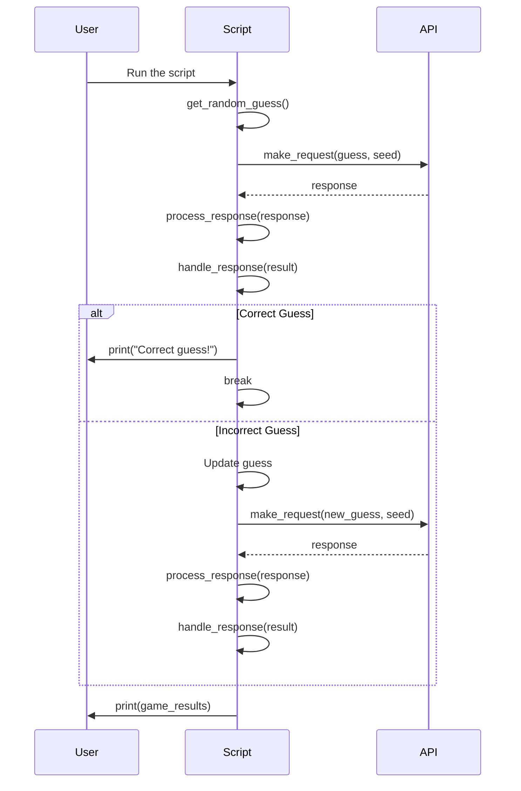

# Python: Wordle Puzzle Game Solution

## **Overview**

(a) Introduction

Wordle is an addictive and popular word puzzle game where the player has to guess a hidden five-letter word within six attempts.
Each guess receives feedback to indicate how close it is to the correct word.
Green squares mean the letter is in the correct position,
yellow squares mean the letter is in the word but in a different position,
and gray squares mean the letter is not in the word at all.

(b) Example on the Guessing Flow

First Guess: Suppose the hidden word is "CRANE" and your guess is "CLOUD".

"C" is in the correct position (green).

"L", "O", and "U" are not in the word (gray).

"D" is also not in the word (gray).

Second Guess: Based on the feedback, you guess "CRATE".

"C" is still correct (green).

"R" is correct but in the wrong position (yellow).

"A" is correct but in the wrong position (yellow).

"T" and "E" are correct but in the wrong position (yellow).

Third Guess: With more refined feedback, you guess "CRANE".

All letters are now in the correct position (green).

Result: You successfully guessed the hidden word within three attempts.

(c) Constants of Wordle

Word Size: Typically five letters.

Max Attempts: Six guesses.

Seed: Used to generate consistent puzzles.

Feedback Colors: Green (correct position), Yellow (wrong position), Gray (not in word).

The beauty of Wordle lies in its simplicity and the strategy involved in making educated guesses based on feedback.
Whether you're playing casually or diving deep into strategy, it's a delightful brain teaser!

## **Usage**

Install prequistes

```bash
make venv
```

Activate the vitural environment

```bash
source venv/Scripts/activate
```

Install requirmen

To run the default setting of guess wordle, using following command

```bash
make run
```

## **Process**

Step 1: Build environment to create solution for the wordle puzzle game

(a) Add `__init__.py` and `guess_wordle.py`

(b) Add `requirements.txt`

(c) Add `.gitignore` for Python [https://github.com/github/gitignore/blob/main/Python.gitignore](https://github.com/github/gitignore/blob/main/Python.gitignore)

(d) Add `Makefile`

Step 2: Build first grant look of the program

First, prompt

```txt
Write me an Python 3 program that
(a) Target: automatically guesses random words against the API, using the following command as an example: curl -v ‘https://wordle.votee.dev:8000/random?guess=theft&seed=1234'
(b) Using the tutorial in: https://thamara.dev/posts/guessing-better-in-wordle/
(c) Constrant: Using httpx for request to the API, Using polars for dataframe, tabular
```

Then install

```txt
Can you describe me the way to handle that with Mermaid diagram
```



This sequence diagram illustrates the flow:

User runs the script.

Script generates a random guess and makes a request to the API.

API returns the response.

Script processes the response and handles the result.

If the guess is correct, the script breaks out of the loop and prints "Correct guess!"

If the guess is incorrect, the script updates the guess and repeats the process.

Second fix

```txt
Fix this `AttributeError: 'list' object has no attribute 'get'`
and using API from You can find the API documentation at the following link: https://wordle.votee.dev:8000/redoc
```

Then using Codeium to handle that with example tutorial link

Prompt `Introduction`

```txt
Write me the overview of the wordle guess
(a) Introduction what is it
(b) Example on the guessing flow
(c) The constant of the wordle (size, seed, ...)
```

## Note

AI Code program: Using Copilot, Codedium

Tutorial: <https://thamara.dev/posts/guessing-better-in-wordle/>
